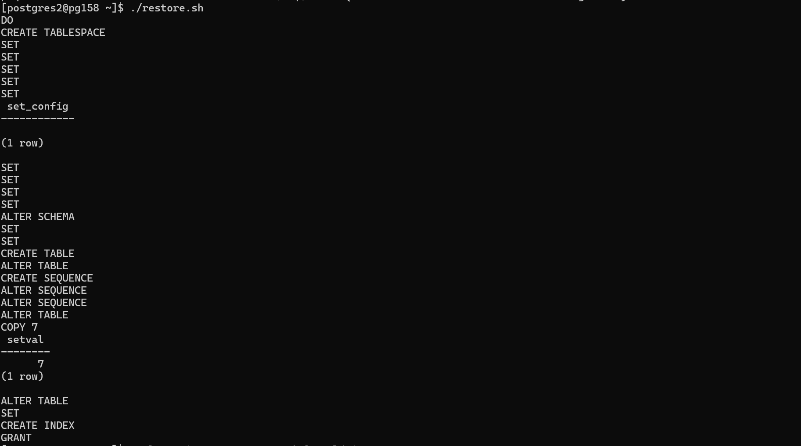
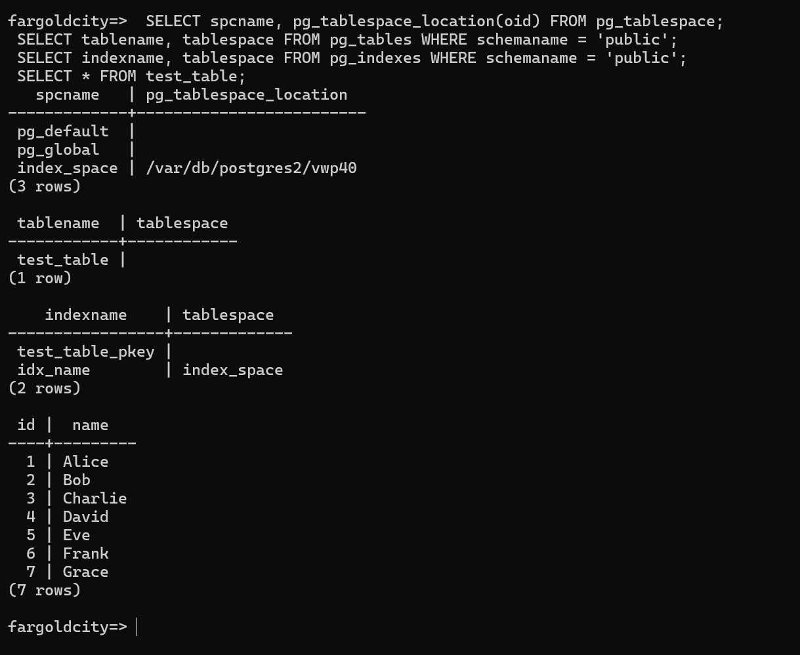
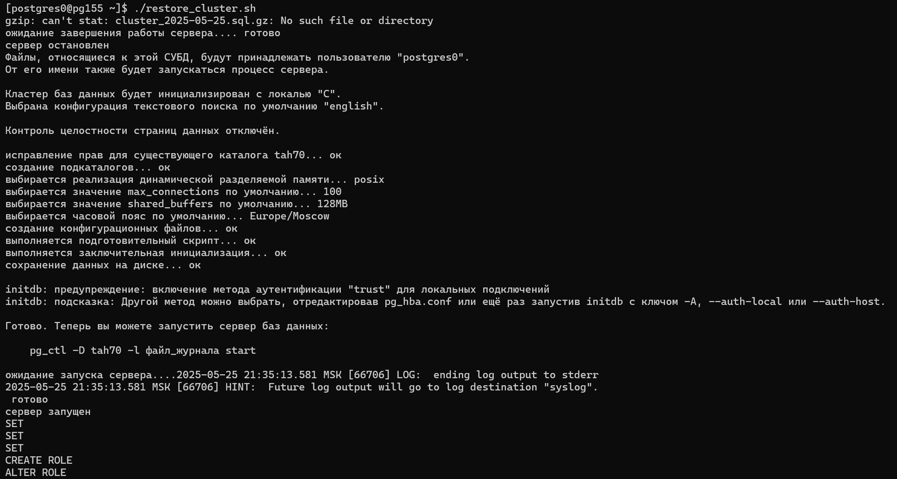
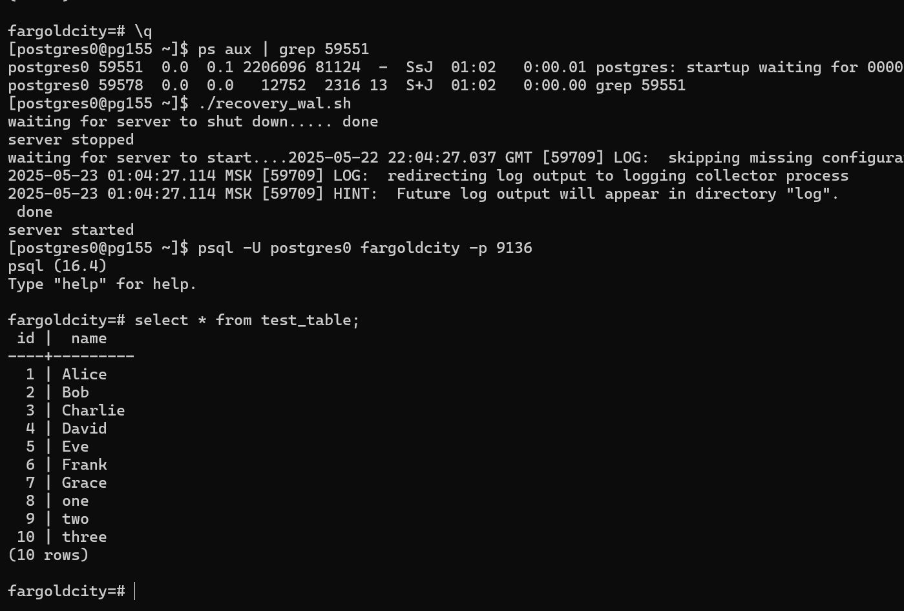

# Distributed Storage Systems | Lab 3 | P3309 | Tupichenko Mila

## Задание

Цель работы - настроить процедуру периодического резервного копирования базы данных, сконфигурированной в ходе
выполнения [лабораторной работы №2](https://github.com/lunghr/distributed_storage_systems_lab2), а также разработать и
отладить сценарии восстановления в случае сбоев.

Узел из предыдущей лабораторной работы используется в качестве основного. Новый узел используется в качестве резервного.
Учётные данные для подключения к новому узлу выдаёт преподаватель. В сценариях восстановления необходимо использовать
копию данных, полученную на первом этапе данной лабораторной работы.

---

### Этап 1. Резервное копирование

Настроить резервное копирование с основного узла на резервный следующим образом:

- Периодические полные копии с помощью SQL Dump.
- По расписанию (cron) раз в сутки, методом SQL Dump с сжатием. Созданные архивы должны сразу перемещаться на резервный
  хост, они не должны храниться на основной системе. Срок хранения архивов на резервной системе - 4 недели. По истечении
  срока хранения, старые архивы должны автоматически уничтожаться.
- Подсчитать, каков будет объем резервных копий спустя месяц работы системы, исходя из следующих условий:
- Средний объем новых данных в БД за сутки: 300МБ.
- Средний объем измененных данных за сутки: 650МБ.
- Проанализировать результаты.

---

### Этап 2. Потеря основного узла

Этот сценарий подразумевает полную недоступность основного узла. Необходимо восстановить работу СУБД на РЕЗЕРВНОМ узле,
продемонстрировать успешный запуск СУБД и доступность данных.

---

### Этап 3. Повреждение файлов БД

Этот сценарий подразумевает потерю данных (например, в результате сбоя диска или файловой системы) при сохранении
доступности основного узла. Необходимо выполнить полное восстановление данных из резервной копии и перезапустить СУБД на
ОСНОВНОМ узле.

Ход работы:

- Симулировать сбой:
    - удалить с диска директорию WAL со всем содержимым.
- Проверить работу СУБД, доступность данных, перезапустить СУБД, проанализировать результаты.
- Выполнить восстановление данных из резервной копии, учитывая следующее условие:
    - исходное расположение дополнительных табличных пространств недоступно - разместить в другой директории и
      скорректировать конфигурацию.
- Запустить СУБД, проверить работу и доступность данных, проанализировать результаты.

---

### Этап 4. Логическое повреждение данных

Этот сценарий подразумевает частичную потерю данных (в результате нежелательной или ошибочной операции) при сохранении
доступности основного узла. Необходимо выполнить восстановление данных на ОСНОВНОМ узле следующим способом:

- Восстановление с использованием архивных WAL файлов. (СУБД должна работать в режиме архивирования WAL, потребуется
  задать параметры восстановления).

Ход работы:

- В каждую таблицу базы добавить 2-3 новые строки, зафиксировать результат.
- Зафиксировать время и симулировать ошибку:
    - удалить любые две таблицы (DROP TABLE)
- Продемонстрировать результат.
- Выполнить восстановление данных указанным способом.
- Продемонстрировать и проанализировать результат.

---

## Выполнение

### Этап 1. Резервное копирование

**Предварительно были прокинуты ssh ключи**

```bash
#!/usr/local/bin/bash

DATE=$(date +"%Y-%m-%d")
BACKUP_NAME="fargoldcity_$DATE.sql"

pg_dump -U postgres0 fargoldcity -p 9136 > ~/"$BACKUP_NAME"

gzip ~/"$BACKUP_NAME"

scp ~/"$BACKUP_NAME".gz postgres2@pg158.cs.ifmo.ru:~/backups

rm ~/"$BACKUP_NAME".gz
```

```shell
pg_dumpall --globals-only | grep -v -i "TABLESPACE" > ~/backups/globals_roles_only.sql
```

Запустим скрипт, чтобы проверить его работоспособность

**Основной узел**

```shell
[postgres0@pg155 ~]$ scripts/backup_script.sh
/var/db/postgres0/fargoldcity_2025-05-21.sql.gz already exists -- do you wish to overwrite (y or n)? y
fargoldcity_2025-05-21.sql.gz                                                         100%  926     1.3MB/s   00:00
[postgres0@pg155 ~]$
```

**Резервный**

```shell
[postgres2@pg158 ~/backups]$ ls
fargoldcity_2025-05-21.sql.gz
[postgres2@pg158 ~/backups]$ ls -l
total 5
-rw-r--r--  1 postgres2 postgres 926 21 мая   23:23 fargoldcity_2025-05-21.sql.gz
[postgres2@pg158 ~/backups]$
```

Теперь настроим ```cron``` на бэкап раз в сутки в 00:00

```shell
crontab -e

0 0 * * * ~/scripts/backup_script.sh >> /var/db/postgres0/backup.log 2>&1

[postgres0@pg155 ~]$ crontab -l
0 0 * * * ~/scripts/backup_script.sh >> /var/db/postgres0/backup.log 2>&1
[postgres0@pg155 ~]$
```

Автоматическое удаление на резервном узле

```shell
[postgres2@pg158 ~]$ crontab -e
0 0 * * * find ~/backups -type f -name "*.gz" -mtime +28 -exec rm {} \;
[postgres2@pg158 ~]$ crontab -l
0 0 * * * find ~/backups -type f -name "*.gz" -mtime +28 -exec rm {} \; 
[postgres2@pg158 ~]$
```

---

### Расчетики

Объём = новые данные + изменённые данные ≈ 300 МБ + 650 МБ = 950 МБ (в несжатом виде)

Объем за день в сжатом виде = 950 МБ * 0.5 = 475 МБ

Объем за месяц = 475 МБ * 28 = 13.3 ГБ

---

### Этап 2. Потеря основного узла

```shell
mkdir tah70
chmod 700 tah70
export PGDATA=~/tah70
initdb --encoding=ISO_8859_5 --username=postgres0 --pwprompt
mkdir vwp40
chmod 700 vwp40
pg_ctl -D $PGDATA start
```

```bash
#!/usr/local/bin/bash

DUMP_FILE=~/backups/fargoldcity_2025-05-21.sql
TABLESPACE_DIR=~/vwp40
PGPORT=5432
PGUSER=postgres0
DBNAME=fargoldcity

mkdir -p "$TABLESPACE_DIR"
chmod 700 "$TABLESPACE_DIR"

psql -U "$PGUSER" -p "$PGPORT" -d postgres -c "DO \$\$ BEGIN IF NOT EXISTS (SELECT FROM pg_roles WHERE 
    rolname = 'cityuser') THEN CREATE ROLE cityuser LOGIN PASSWORD '1234'; END IF; END \$\$;"

psql -U "$PGUSER" -p "$PGPORT" -d postgres -c "SELECT 1 FROM pg_tablespace WHERE spcname = 'index_space';" | grep -q 1
if [ $? -ne 0 ]; then
  psql -U "$PGUSER" -p "$PGPORT" -d postgres -c "CREATE TABLESPACE index_space LOCATION '$TABLESPACE_DIR';"
fi

psql -U "$PGUSER" -p "$PGPORT" -d postgres -c "SELECT 1 FROM pg_database WHERE datname = '$DBNAME';" | grep -q 1
if [ $? -ne 0 ]; then
  createdb -U "$PGUSER" -p "$PGPORT" -O "$PGUSER" "$DBNAME"
fi

psql -U "$PGUSER" -p "$PGPORT" -d "$DBNAME" < "$DUMP_FILE"

```

И если мы теперь зайдем в бд и посмотрим табличку, то все на месте

```shell
[postgres2@pg158 ~]$ psql -U cityuser -p 5432 -d fargoldcity
psql (16.4)
Type "help" for help.

fargoldcity=> \du
                             List of roles
 Role name |                         Attributes
-----------+------------------------------------------------------------
 cityuser  |
 postgres0 | Superuser, Create role, Create DB, Replication, Bypass RLS
 
fargoldcity=> select * from test_table
fargoldcity-> ;
 id |  name
----+---------
  1 | Alice
  2 | Bob
  3 | Charlie
  4 | David
  5 | Eve
  6 | Frank
  7 | Grace
(7 rows)

fargoldcity=>
```

<details>
<summary>Пруфы скринами</summary>



</details>

---

### Этап 3. Повреждение файлов БД

Ломаем файлы

```shell
rm -rf "$PGDATA/pg_wal"/*
pg_ctl -D "$PGDATA" restart 
```

Без перезапуска сервера, зайдя в бд, мы увидим, что все в порядке и наши данные на месте, но при перезапуске сервер не
поднимется. Это связано с тем, что в каталоге pg_wal содержит журналы предзаписи, необходимые для обеспечения
целостности данных при старте. Поэтому сервер не сможет восстановить согласованность бд при перезапуске и откажется
запускаться.

```shell
[postgres0@pg155 ~]$ rm -rf tah70/pg_wal/
[postgres0@pg155 ~]$ ls
backup.log                      globals.sql.gz                  restore_base.sh                 tah70
fargoldcity_2025-05-22.sql      new_vwp40                       scripts                         vwp40
[postgres0@pg155 ~]$ psql -U postgres0 -p 9136 fargoldcity
psql (16.4)
Type "help" for help.

fargoldcity=# \su
invalid command \su
Try \? for help.
fargoldcity=# \du
                             List of roles
 Role name |                         Attributes
-----------+------------------------------------------------------------
 cityuser  |
 postgres0 | Superuser, Create role, Create DB, Replication, Bypass RLS

fargoldcity=# ls
fargoldcity-# select * from test_table;
ERROR:  syntax error at or near "ls"
LINE 1: ls
        ^
fargoldcity=#
select * from test_table;
 id |  name
----+---------
  1 | Alice
  2 | Bob
  3 | Charlie
  4 | David
  5 | Eve
  6 | Frank
  7 | Grace
(7 rows)

fargoldcity=# \q
[postgres0@pg155 ~]$ pg_ctl restart
waiting for server to shut down...... done
server stopped
waiting for server to start....2025-05-22 01:14:00.755 MSK [30833] LOG:  ending log output to stderr
2025-05-22 01:14:00.755 MSK [30833] HINT:  Future log output will go to log destination "syslog".
 stopped waiting
pg_ctl: could not start server
Examine the log output.
[postgres0@pg155 ~]$ psql -U postgres0 -p 9136 fargoldcity
psql: error: connection to server on socket "/tmp/.s.PGSQL.9136" failed: No such file or directory
        Is the server running locally and accepting connections on that socket?
[postgres0@pg155 ~]$
```

Поэтому получаем с резерва последний бэкап

```shell
[postgres2@pg158 ~]$ scp backups/fargoldcity_2025-05-22.sql.gz postgres0@pg155.cs.ifmo.ru:~/
(postgres0@pg155.cs.ifmo.ru) Password for postgres0@pg155.cs.ifmo.ru:
fargoldcity_2025-05-22.sql.gz                                                             100%  926     1.3MB/s   00:00
```

Удаляем прошлый кластер и пересоздаем новый, так как содержимое кластера становится недостоверным, единственный надёжный
способ восстановить работу СУБД — полностью переинициализировать кластер с помощью initdb, а затем восстановить данные
из резервной копии.

```shell
[postgres0@pg155 ~]$ rm -rf tah70
[postgres0@pg155 ~]$ mkdir tah70
[postgres0@pg155 ~]$ chmod 700 tah70
[postgres0@pg155 ~]$ export PGDATA=~/tah70
[postgres0@pg155 ~]$ initdb --encoding=ISO_8859_5 --username=postgres0 --pwprompt
### А тут я меняю порты на 9136 с 5432
[postgres0@pg155 ~]$ pg_ctl -D $PGDATA start
````

И запускаем скрипт восстановления

```bash
#!/usr/local/bin/bash

PGPORT=9136
PGUSER=postgres0
DBNAME=fargoldcity
DUMP_FILE=~/fargoldcity_2025-05-22.sql
NEW_TABLESPACE_DIR=~/new_vwp40
TABLESPACE_NAME=index_space


mkdir -p "$NEW_TABLESPACE_DIR"
chmod 700 "$NEW_TABLESPACE_DIR"

psql -U "$PGUSER" -p "$PGPORT" -d postgres -tc "SELECT 1 FROM pg_roles WHERE rolname='cityuser'" | grep -q 1 || \
psql -U "$PGUSER" -p "$PGPORT" -d postgres -c "CREATE ROLE cityuser LOGIN PASSWORD '1234';"

psql -U "$PGUSER" -p "$PGPORT" -d postgres -tc "SELECT 1 FROM pg_tablespace WHERE spcname='$TABLESPACE_NAME'" | grep -q 1 || \
psql -U "$PGUSER" -p "$PGPORT" -d postgres -c "CREATE TABLESPACE $TABLESPACE_NAME LOCATION '$NEW_TABLESPACE_DIR';"

psql -U "$PGUSER" -p "$PGPORT" -lqt | cut -d \| -f 1 | grep -qw "$DBNAME" || \
psql -U "$PGUSER" -p "$PGPORT" -d postgres -c "CREATE DATABASE $DBNAME OWNER $PGUSER TEMPLATE template1;"

gzip -d "$DUMP_FILE".gz

psql -U "$PGUSER" -p "$PGPORT" -d "$DBNAME" < "$DUMP_FILE"
psql -U "$PGUSER" -p "$PGPORT" -d "$DBNAME" -c '\dt'
```

**Результат**

```shell
[postgres0@pg155 ~]$ ./restore_base.sh
CREATE ROLE
CREATE TABLESPACE
CREATE DATABASE
SET
SET
SET
SET
SET
 set_config
------------

(1 row)

SET
SET
SET
SET
ALTER SCHEMA
SET
SET
CREATE TABLE
ALTER TABLE
CREATE SEQUENCE
ALTER SEQUENCE
ALTER SEQUENCE
ALTER TABLE
COPY 7
 setval
--------
      7
(1 row)

ALTER TABLE
SET
CREATE INDEX
GRANT
           List of relations
 Schema |    Name    | Type  |  Owner
--------+------------+-------+----------
 public | test_table | table | cityuser
(1 row)
```

<details>
<summary>Пруфы скринами</summary>

</details>

---

### Этап 4. Логическое повреждение данных

Чтобы восстановить базу после логической ошибки (например, случайного удаления таблиц), нужно заранее включить
сохранение архивных WAL-файлов — это специальные журналы, которые фиксируют все изменения в базе. Плюсом ко всему нам
нужен base backup, так что создаем директорию и для него

Конфигурируем ```postgresql.conf```

```shell
wal_level = replica
archive_mode = on
archive_command = 'cp %p /var/db/postgres0/backups/wal/%f'
```

```wal_level = replica ``` включает расширенное логирование изменений, необходимое для возможности восстановления

```archive_mode = on ```включает режим архивирования WAL-файлов

```archive_command ``` указывает директорию, куда будут сохраняться архивы

Потом создаем директорию для архивов и бэкапов, перезапускаем сервер и заходим в бд

```shell
mkdir -p /var/db/postgres0/backups/wal
mkdir -p /var/db/postgres0/backups/base
chmod 700 /var/db/postgres0/backups/wal
chmod 700 /var/db/postgres0/backups/base
```

```shell
pg_ctl -D $PGDATA restart
psql -U postgres0 -p 9136 fargoldcity
```

Руками создаем бэкап нашей исходной базы

```shell
pg_basebackup -D ~/backups/base/2025-05-22 -Ft -z -P -X stream
```

После чего со спокойной душой можем ломать таблицу

```shell
[postgres0@pg155 ~]$ clear
[postgres0@pg155 ~]$ psql -U postgres0 -p 9136 fargoldcity
psql (16.4)
Type "help" for help.

fargoldcity=# select * from test_table;
 id |  name
----+---------
  1 | Alice
  2 | Bob
  3 | Charlie
  4 | David
  5 | Eve
  6 | Frank
  7 | Grace
(7 rows)

fargoldcity=# INSERT INTO test_table (name) VALUES ('one'), ('two'), ('three');
INSERT 0 3
fargoldcity=# select * from test_table;
 id |  name
----+---------
  1 | Alice
  2 | Bob
  3 | Charlie
  4 | David
  5 | Eve
  6 | Frank
  7 | Grace
  8 | one
  9 | two
 10 | three
(10 rows)

fargoldcity=# SELECT now();
              now
-------------------------------
 2025-05-23 00:05:54.390419+03
(1 row)

fargoldcity=# DROP TABLE test_table;
DROP TABLE
fargoldcity=# select * from test_table;
ERROR:  relation "test_table" does not exist
LINE 1: select * from test_table;
                      ^
fargoldcity=#
```

Теперь нам нужно восстановить базу до состояния до удаления таблицы. Для этого мы будем использовать скрипт ниже

```bash
#!/usr/local/bin/bash

export PGDATA="/var/db/postgres0/tah70"
ARCHIVE_DIR="/var/db/postgres0/wal"
PGUSER="postgres0"
BACKUP_DIR="/var/db/postgres0/backups/base"
BACKUP_FILE="2025-05-22"
WAL="/var/db/postgres0/backups/wal"
PGPORT=9136
TABLESPACE_DIR="/var/db/postgres0/new_vwp40"
TIME='2025-05-23 00:05:54.390419+03'


pg_ctl stop

rm -rf "$TABLESPACE_DIR"
mkdir -p "$TABLESPACE_DIR"
chown -R "$PGUSER":postgres "$TABLESPACE_DIR"
rm -rf "$PGDATA"/*
mkdir -p "$PGDATA"
chown -R "$PGUSER":postgres "$PGDATA"

chmod 700 "$PGDATA"

tar -xzf "$BACKUP_DIR/$BACKUP_FILE/base.tar.gz" -C "$PGDATA"
tar -xzf "$BACKUP_DIR/$BACKUP_FILE/pg_wal.tar.gz" -C "$ARCHIVE_DIR"
mv -n "$WAL"/* "$ARCHIVE_DIR"

tar -xzf "$BACKUP_DIR/$BACKUP_FILE/16385.tar.gz" -C "$TABLESPACE_DIR"

rm -rf "$PGDATA"/pg_tblspc/*
rm -f "$PGDATA"/pg_tablespace_map/*
ln -s "$TABLESPACE_DIR" "$PGDATA"/pg_tblspc/16385

CONF="$PGDATA/postgresql.conf"
sed -i '' '/^[[:space:]]*#*[[:space:]]*archive_mode/d' "$CONF"
sed -i '' '/^[[:space:]]*#*[[:space:]]*archive_command/d' "$CONF"
sed -i '' '/^[[:space:]]*#*[[:space:]]*recovery_target_timeline/d' "$CONF"
sed -i '' '/^[[:space:]]*#*[[:space:]]*recovery_target_time/d' "$CONF"
sed -i '' '/^[[:space:]]*#*[[:space:]]*restore_command/d' "$CONF"


cat >> "$CONF" <<EOF
archive_mode = 'off'
archive_command = ''
restore_command= 'cp $ARCHIVE_DIR/%f %p'
recovery_target_time = '$TIME'
recovery_target_action = 'promote'
EOF

rm -rf $PGDATA/postgresql.auto.conf
touch $PGDATA/recovery.signal

chown -R $PGUSER:postgres $PGDATA
chmod 700 $PGDATA
pg_ctl start
  
  
```  

Выполнив который получаем восстановление базы до состояния до удаления таблиц

```shell
[postgres0@pg155 ~]$ ./recovery_wal.sh
waiting for server to shut down..... done
server stopped
waiting for server to start....2025-05-22 22:04:27.037 GMT [59709] LOG:  skipping missing configuration file "/var/db/postgres0/tah70/postgresql.auto.conf"
2025-05-23 01:04:27.114 MSK [59709] LOG:  redirecting log output to logging collector process
2025-05-23 01:04:27.114 MSK [59709] HINT:  Future log output will appear in directory "log".
 done
server started
[postgres0@pg155 ~]$ psql -U postgres0 fargoldcity -p 9136
psql (16.4)
Type "help" for help.

fargoldcity=# select * from test_table;
 id |  name
----+---------
  1 | Alice
  2 | Bob
  3 | Charlie
  4 | David
  5 | Eve
  6 | Frank
  7 | Grace
  8 | one
  9 | two
 10 | three
(10 rows)

fargoldcity=#
```

<details>
<summary>Пруфы скринами</summary>

</details>  

---

## Вывод

В ходе выполнения лабораторной работы была настроена система резервного копирования и восстановления базы данных. Причем
несколькими способами. Создание базовых бэкапов для восстановления базы данных из WAL файлов вообще не было очевидным
пунктом, из-за чего было потрачено очень много нервов и самообладания на то, чтобы не расплакаться. Но теперь я знаю об
этом и умею восстанавливать базы двумя способами. Таким образом, данная лабораторная работы была полезной.