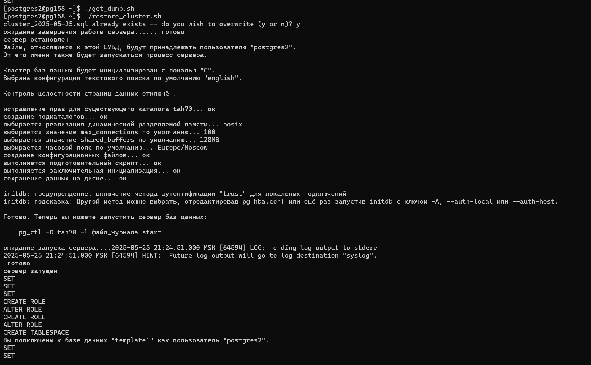

# Distributed Storage Systems | Lab 3 | P3309 | Tupichenko Mila

## Задание

Цель работы - настроить процедуру периодического резервного копирования базы данных, сконфигурированной в ходе
выполнения [лабораторной работы №2](https://github.com/lunghr/distributed_storage_systems_lab2), а также разработать и
отладить сценарии восстановления в случае сбоев.

Узел из предыдущей лабораторной работы используется в качестве основного. Новый узел используется в качестве резервного.
Учётные данные для подключения к новому узлу выдаёт преподаватель. В сценариях восстановления необходимо использовать
копию данных, полученную на первом этапе данной лабораторной работы.

---

### Этап 1. Резервное копирование

Настроить резервное копирование с основного узла на резервный следующим образом:

- Периодические полные копии с помощью SQL Dump.
- По расписанию (cron) раз в сутки, методом SQL Dump с сжатием. Созданные архивы должны сразу перемещаться на резервный
  хост, они не должны храниться на основной системе. Срок хранения архивов на резервной системе - 4 недели. По истечении
  срока хранения, старые архивы должны автоматически уничтожаться.
- Подсчитать, каков будет объем резервных копий спустя месяц работы системы, исходя из следующих условий:
- Средний объем новых данных в БД за сутки: 300МБ.
- Средний объем измененных данных за сутки: 650МБ.
- Проанализировать результаты.

---

### Этап 2. Потеря основного узла

Этот сценарий подразумевает полную недоступность основного узла. Необходимо восстановить работу СУБД на РЕЗЕРВНОМ узле,
продемонстрировать успешный запуск СУБД и доступность данных.

---

### Этап 3. Повреждение файлов БД

Этот сценарий подразумевает потерю данных (например, в результате сбоя диска или файловой системы) при сохранении
доступности основного узла. Необходимо выполнить полное восстановление данных из резервной копии и перезапустить СУБД на
ОСНОВНОМ узле.

Ход работы:

- Симулировать сбой:
    - удалить с диска директорию WAL со всем содержимым.
- Проверить работу СУБД, доступность данных, перезапустить СУБД, проанализировать результаты.
- Выполнить восстановление данных из резервной копии, учитывая следующее условие:
    - исходное расположение дополнительных табличных пространств недоступно - разместить в другой директории и
      скорректировать конфигурацию.
- Запустить СУБД, проверить работу и доступность данных, проанализировать результаты.

---

### Этап 4. Логическое повреждение данных

Этот сценарий подразумевает частичную потерю данных (в результате нежелательной или ошибочной операции) при сохранении
доступности основного узла. Необходимо выполнить восстановление данных на ОСНОВНОМ узле следующим способом:

- Восстановление с использованием архивных WAL файлов. (СУБД должна работать в режиме архивирования WAL, потребуется
  задать параметры восстановления).

Ход работы:

- В каждую таблицу базы добавить 2-3 новые строки, зафиксировать результат.
- Зафиксировать время и симулировать ошибку:
    - удалить любые две таблицы (DROP TABLE)
- Продемонстрировать результат.
- Выполнить восстановление данных указанным способом.
- Продемонстрировать и проанализировать результат.

---

## Выполнение

### Этап 1. Резервное копирование

**Предварительно были прокинуты ssh ключи**

```bash
#!/usr/local/bin/bash

DATE=$(date +"%Y-%m-%d")
BACKUP_NAME="fargoldcity_$DATE.sql"

pg_dump -U postgres0 fargoldcity -p 9136 > ~/"$BACKUP_NAME"

gzip ~/"$BACKUP_NAME"

scp ~/"$BACKUP_NAME".gz postgres2@pg158.cs.ifmo.ru:~/backups

rm ~/"$BACKUP_NAME".gz
```

Запустим скрипт, чтобы проверить его работоспособность

**Основной узел**

```shell
[postgres0@pg155 ~]$ scripts/backup_script.sh
/var/db/postgres0/fargoldcity_2025-05-21.sql.gz already exists -- do you wish to overwrite (y or n)? y
fargoldcity_2025-05-21.sql.gz                                                         100%  926     1.3MB/s   00:00
[postgres0@pg155 ~]$
```

**Резервный**

```shell
[postgres2@pg158 ~/backups]$ ls
fargoldcity_2025-05-21.sql.gz
[postgres2@pg158 ~/backups]$ ls -l
total 5
-rw-r--r--  1 postgres2 postgres 926 21 мая   23:23 fargoldcity_2025-05-21.sql.gz
[postgres2@pg158 ~/backups]$
```

Теперь настроим ```cron``` на бэкап раз в сутки в 00:00

```shell
crontab -e

0 0 * * * ~/scripts/backup_script.sh >> /var/db/postgres0/backup.log 2>&1

[postgres0@pg155 ~]$ crontab -l
0 0 * * * ~/scripts/backup_script.sh >> /var/db/postgres0/backup.log 2>&1
[postgres0@pg155 ~]$
```

Автоматическое удаление на резервном узле

```shell
[postgres2@pg158 ~]$ crontab -e
0 0 * * * find ~/backups -type f -name "*.gz" -mtime +28 -exec rm {} \;
[postgres2@pg158 ~]$ crontab -l
0 0 * * * find ~/backups -type f -name "*.gz" -mtime +28 -exec rm {} \; 
[postgres2@pg158 ~]$
```

---

### Расчетики

Объём = новые данные + изменённые данные ≈ 300 МБ + 650 МБ = 950 МБ (в несжатом виде)

Объем за день в сжатом виде = 950 МБ * 0.5 = 475 МБ

Объем за месяц = 475 МБ * 28 = 13.3 ГБ

---

### Этап 2. Потеря основного узла

```shell
[postgres2@pg158 ~]$ mkdir tah70
[postgres2@pg158 ~]$ chmod 700 tah70
[postgres2@pg158 ~]$ initdb --encoding=ISO_8859_5 --username=postgres0 --pwprompt
[postgres2@pg158 ~]$ mkdir vwp40
[postgres2@pg158 ~]$ chmod 700 vwp40
```

```bash
#!/usr/local/bin/bash

DUMP_FILE=~/backups/fargoldcity_2025-05-21.sql
TABLESPACE_DIR=~/vwp40
PGPORT=5432
PGUSER=postgres0
DBNAME=fargoldcity

mkdir -p "$TABLESPACE_DIR"
chmod 700 "$TABLESPACE_DIR"

psql -U "$PGUSER" -p "$PGPORT" -d postgres -c "DO \$\$ BEGIN IF NOT EXISTS (SELECT FROM pg_roles WHERE 
    rolname = 'cityuser') THEN CREATE ROLE cityuser LOGIN PASSWORD '1234'; END IF; END \$\$;"

psql -U "$PGUSER" -p "$PGPORT" -d postgres -c "SELECT 1 FROM pg_tablespace WHERE spcname = 'index_space';" | grep -q 1
if [ $? -ne 0 ]; then
  psql -U "$PGUSER" -p "$PGPORT" -d postgres -c "CREATE TABLESPACE index_space LOCATION '$TABLESPACE_DIR';"
fi

psql -U "$PGUSER" -p "$PGPORT" -d postgres -c "SELECT 1 FROM pg_database WHERE datname = '$DBNAME';" | grep -q 1
if [ $? -ne 0 ]; then
  createdb -U "$PGUSER" -p "$PGPORT" -O "$PGUSER" "$DBNAME"
fi

psql -U "$PGUSER" -p "$PGPORT" -d "$DBNAME" < "$DUMP_FILE"

```

И если мы теперь зайдем в бд и посмотрим табличку, то все на месте

```shell
[postgres2@pg158 ~]$ psql -U cityuser -p 5432 -d fargoldcity
psql (16.4)
Type "help" for help.

fargoldcity=> \du
                             List of roles
 Role name |                         Attributes
-----------+------------------------------------------------------------
 cityuser  |
 postgres0 | Superuser, Create role, Create DB, Replication, Bypass RLS
 
fargoldcity=> select * from test_table
fargoldcity-> ;
 id |  name
----+---------
  1 | Alice
  2 | Bob
  3 | Charlie
  4 | David
  5 | Eve
  6 | Frank
  7 | Grace
(7 rows)

fargoldcity=>
```

<details>
<summary>Пруфы скринами</summary>



</details>

